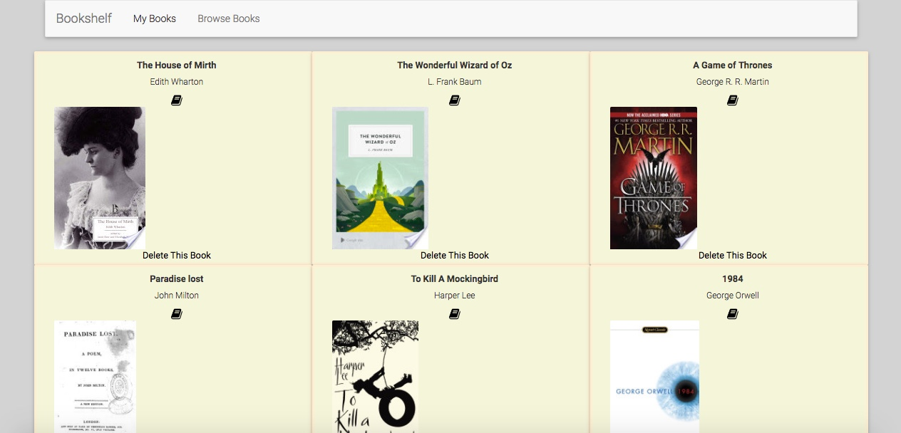
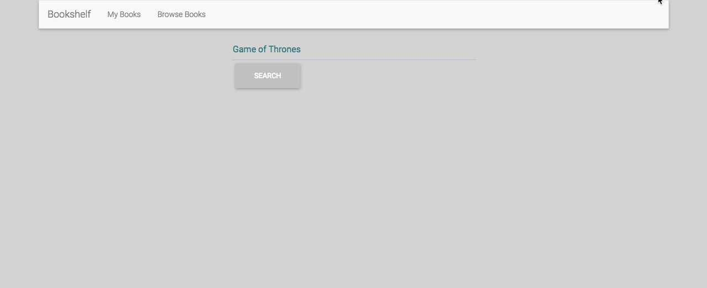
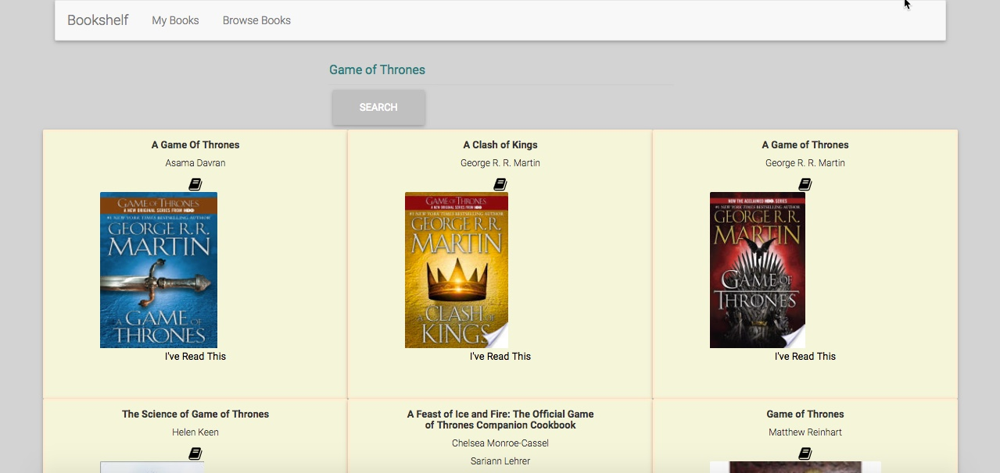
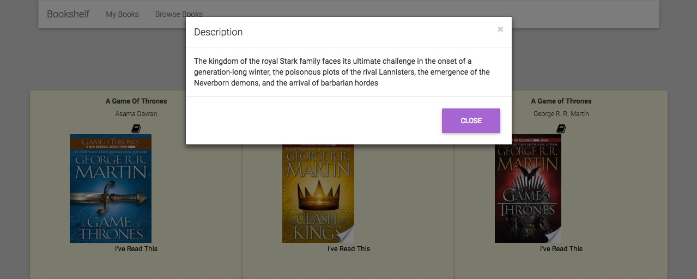
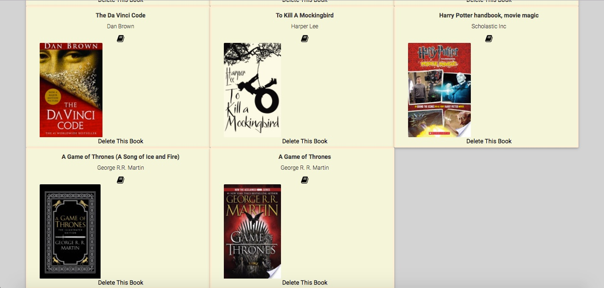

# Bookshelf
Bookshelf is an AngularJS application that allows users to browse through thousands of books and create a unique list of the books they’ve read.

After I graduated college, I stopped reading almost altogether. I wanted an app that would allow me to easily browse through books and make a list of the ones I’ve read, creating a visual representation of my progress. Bookshelf was the perfect solution.

## About

Bookshelf is built in the AngularJS framework and uses the Google Books API to provide results for book searches. Firebase acts as the real-time database for the application.

## Tech Stack
AngularJS, Firebase, Bootstrap, HTML5, CSS

## App

Users can search for any title they can think of...

Using the Google Books API, millions of titles are available.

Users then see 10 books that best match their search.

The first 10 books available that match the API specifications populate the page.

Users can view a brief description of each book by clicking on the book icon above the book cover.

A simple call to the API brings a short description to a modal.

The book is then added to the user's profile.

Firebase is updated when user's add a book, and then they are taken to their profile view of all of their added books.

## -Version 2- Coming Soon!-
Upcoming Features-

User Authentication- Using Firebase user authentication, users can create accounts and build their own profile.
Search Features - Users can search books by genre, author, and publication date.
Bookshelf Clubs- Users can create book clubs that other users can view and contribute to.
Deployment- Deployment through Heroku